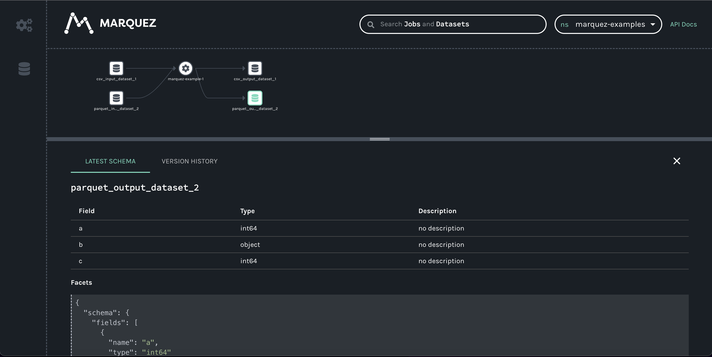

# pandas-lineage Example using Marquez

## Instructions:
1. install pandas-lineage
   * `pip install pandas-lineage`
   * `pip install pyarrow`
     * optional for parquet; remove or comment out parquet IO lines to avoid additional installation
2. start marquez using the helper script `start_marquez.sh`
   * `source ./start_marquez.sh`
3. run `getting_started.py`
   * `python marquez_example.py`